<div align="center">

# Homunculus Bloc

### AI × AI — Artificial Intelligence × Architectural Intelligence

**[Tianxiao Peng](https://ptianxiao.github.io#about)** — California-licensed Architect · SCI-Arc MS

[**🌐 Project Page**](https://ptianxiao.github.io) · [**🎬 Demo Video**](https://youtu.be/xL737XE9c8c) · [**⚙️ Technology Stack**](https://youtu.be/JGj_xInnKJw) · [**📧 Contact**](mailto:pengtianxiao@gmail.com)

**🎥 Final exhibition films:** [Part 1](assets/Peng_1_web.mp4) · [Part 2](assets/Peng_2_web.mp4) — playable on the [project page](https://ptianxiao.github.io)

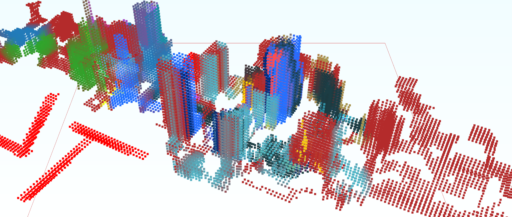

*The semantic color-voxel system: a machine-readable field that human hands can shape.*

</div>

---

## Abstract

Homunculus Bloc is a design workflow that employs machine learning to let a computer monitor physical, 3D-printed blocks. Architects intuitively manipulate the blocks, and the system converts those physical attributes into digital models — preserving the natural creativity of manual design while still drawing on computational power.

Computer-assisted design technologies (BIM, parametric modeling, procedural modeling, generative AI) are now so dominant that they greatly reduce the need for a designer's hands-on involvement. But does this evolution enhance architectural intelligence? Do we still need our hands to improve it?

> “If we are not fully utilizing our hands, perhaps we are also not fully utilizing our brains.”

---

## 01 · Why “homunculus”?

The sensory (or motor) homunculus is a visual representation of how the brain perceives the body. Body parts are drawn in proportion to how much cortex is dedicated to them: the hands and lips appear enormous because they carry the most sensory nerve endings — the most brain power.

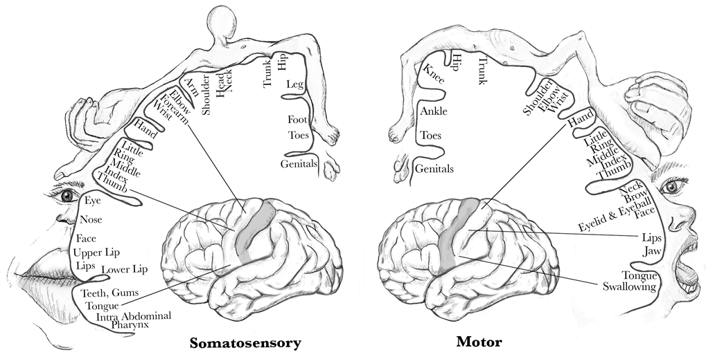
*Fig 01 — Cortical maps: the somatosensory and motor homunculus*

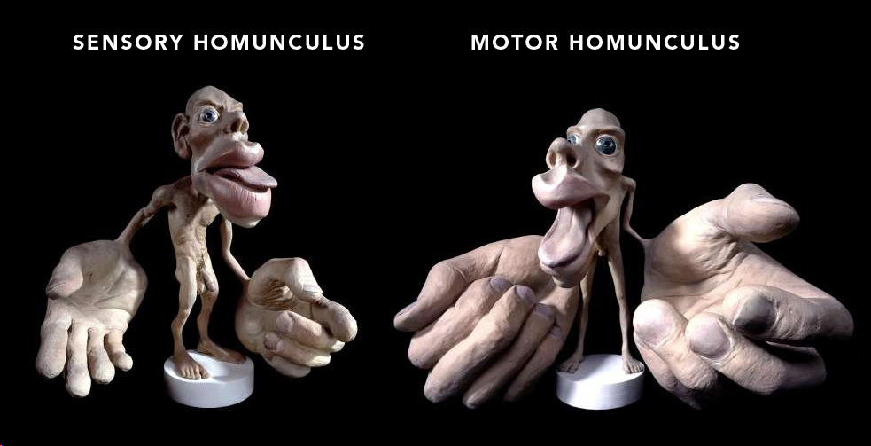
*Fig 02 — Sensory homunculus model by Sharon Price-James*

The rise of computers, smartphones, and touch screens has significantly decreased the practice of real-world, hands-on skills. Our hands mostly tap keys and swipe glass, which reduces the stimulation reaching the sensorimotor cortex. What might the long-term effects be, on us and on our society? **As the old saying goes — *use it or lose it.***

---

## 02 · The Homunculus Bloc

The Homunculus Bloc is a 3D-printable object made to be handled: it interlocks with other blocks and is shaped so a computer can efficiently track each block's unique ID, position, and orientation. Those attributes synchronize with the digital environment, so the computer is aware of hand interactions in real time.

An interactive 3D model of the blocs is on the [project page](https://ptianxiao.github.io) — the model file itself is [`assets/bloc all.glb`](assets/bloc%20all.glb).

### Computer vision

Synthetic data generated by the computer makes training cost-effective. The trained model lets the computer recognize the physical blocks in the real world.

🎞 **Fig 03 — The machine learning process, illustrated:** [`assets/P-Block.mp4`](assets/P-Block.mp4)

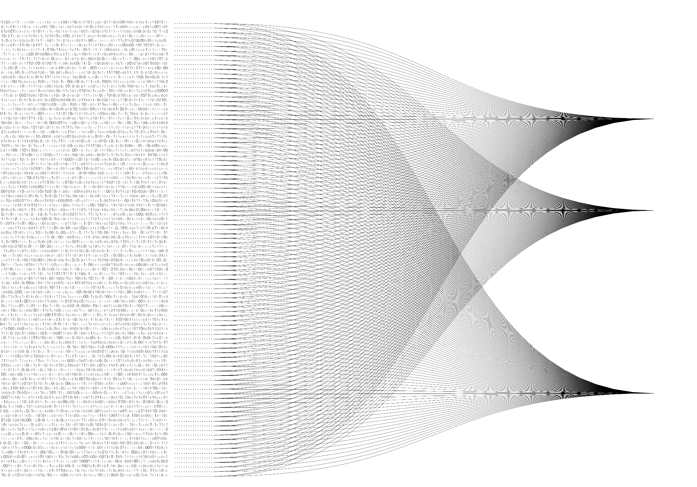
*Fig 04 — The machine's own homunculus: a neural network, drawn line by line*

The digital modeling environment captures attributes from the physical blocks, then generates input for a diffusion model, which turns the arrangement into images:

[](https://youtu.be/L1v9sZLn3c8)
*Fig 05 — Blocks → digital model → diffusion imagery (click to watch)*

---

## 03 · Voxel System

Adding a semantic, color-coded layer to the traditional Wave Function Collapse (WFC) method makes its results interactively controllable — turning WFC into a design tool. The key is a 3D voxel meta-structure that stores semantic attributes in each voxel's color, value, and tensor information; the algorithm then links meta-tiles to detailed tiles in real time.

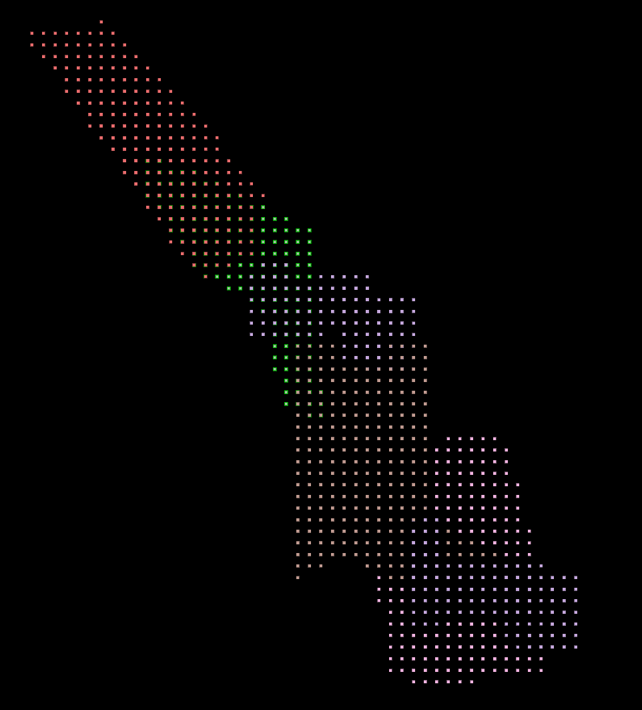
*Fig 06 — Color voxel system, in plan*

### Taming 2²⁶ neighbors

In 3D Wave Function Collapse, a voxel has 26 possible neighboring positions — 2²⁶ potential neighbor configurations, an extremely large number. The moon's phases are a useful analogy for managing that complexity: just as the elliptical phase is the most common, most voxel neighborhoods follow common patterns. Like the full moon arriving every month, some configurations are less frequent but still predictable. And there are rare events — the supermoon, the blue moon, the harvest moon — the least common neighborhoods of all.

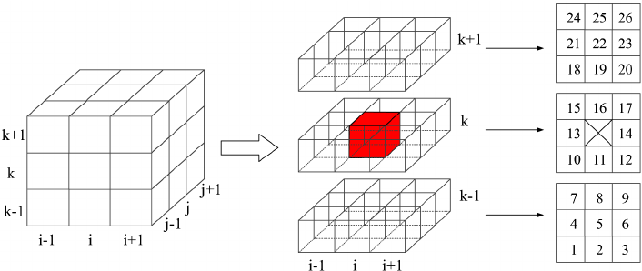
*Fig 07 — The 26 neighbors of a voxel*

| Fig 08 — Possibilities of neighbor conditions | Fig 09 — Phases of the moon |
|---|---|
| 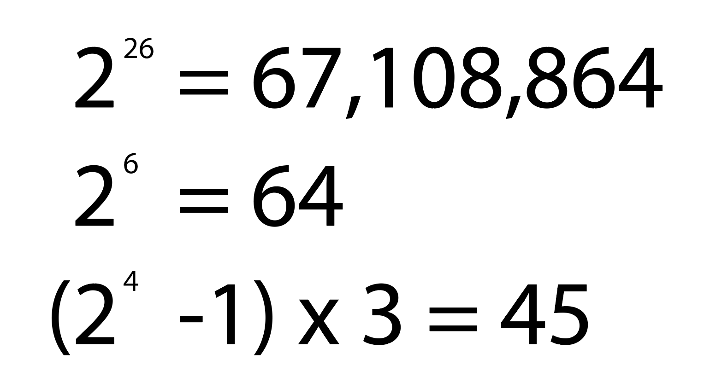 |  |

The voxel sculpting tool (work in progress) lets designers intuitively shape the voxel field with multiple sets of semantic WFC modules:

[](https://youtu.be/H6aqc9BjUYY)
*Fig 10 — Voxel sculpting with semantic WFC modules (click to watch)*

---

## 04 · AI × AI Grasshopper Plugin

Grasshopper is the user interface that brings these technologies together: block tracking, voxel sculpting, delegates, point clouds, diffusion agents, and WFC part-making live as components inside the Rhino environment, intuitively driving the attributes of the voxel system.

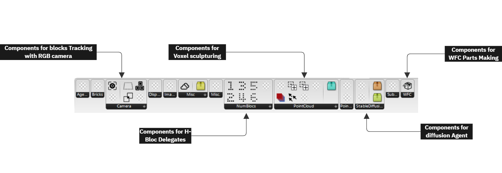
*Fig 11 — The plugin toolbar: camera tracking, H-bloc delegates, voxel sculpting, diffusion agent, WFC parts*

[](https://youtu.be/Io0Cp6axjHM)
*Fig 12 — The plugin at work (click to watch)*

---

## 05 · Lineage

The voxel field has ancestors. Superstudio's *Continuous Monument* and *Supersurface* (1966–1978) imagined the grid as an infinite, neutral field for life — an architecture reduced to a lattice that people inhabit through their own acts. The Homunculus Bloc borrows that field and hands it back to the fingertips.

| | |
|---|---|
| 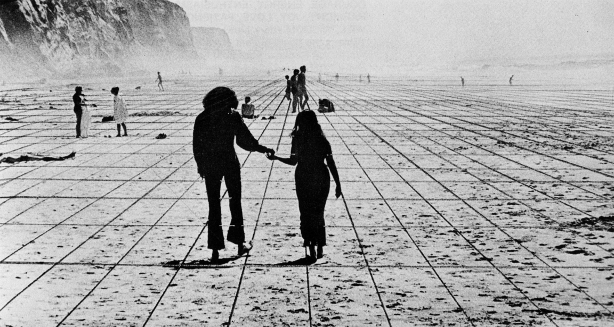 | 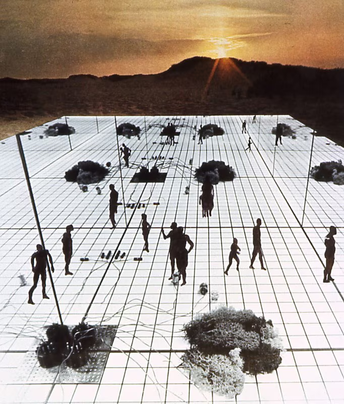 |
| 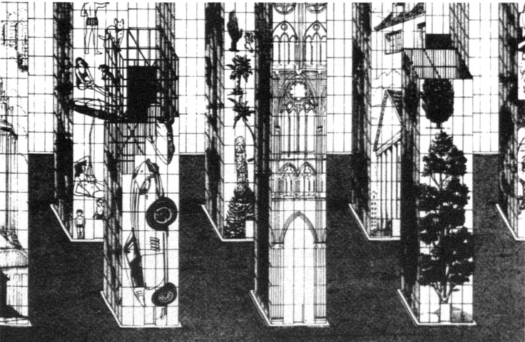 | 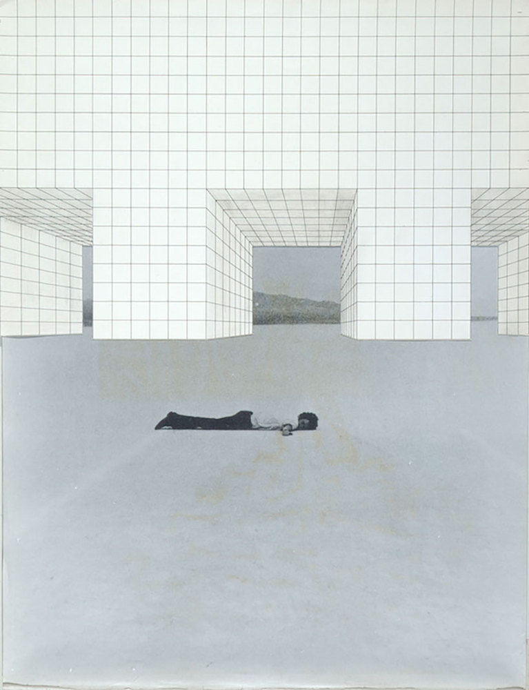 |

*Superstudio, Continuous Monument / Supersurface studies. See also: Superstudio: Opere 1966–1978, ed. Gabriele Mastrigli.*

---

## About the author

Tianxiao Peng is a California-licensed architect with 15 years of professional experience, specializing in innovative design using open-source tools. He has 12 years of Grasshopper scripting and 10 years of Python programming behind him, and is currently developing a Grasshopper plugin in C#. Tianxiao holds a Master of Science from SCI-Arc and a Master of Architecture from Ball State University. He is committed to leveraging technology's profound impact on architecture and society.

**Contact:** [pengtianxiao@gmail.com](mailto:pengtianxiao@gmail.com) · (+1) 626 688 0979

## Citation

If you reference this project, please cite:

```bibtex
@misc{peng_homunculus_bloc,
  author = {Peng, Tianxiao},
  title  = {Homunculus Bloc: Artificial Intelligence {\texttimes} Architectural Intelligence},
  year   = {2024},
  url    = {https://ptianxiao.github.io}
}
```
